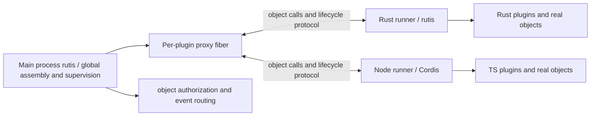

# Protocol Plugin Design: Cross-Language Objects and Plugin Systems for rutis / Cordis

> Historical proposal; not a requirement or implementation basis for this branch. Current definition: [protocol plugin requirements](requirements-protocol-plugins.en.md); new design: [cross-process mount design](design-protocol-plugin-mount.en.md). The mechanisms, roadmap, and acceptance gates below are not carried forward.
>
> Redesigned 2026-09-27, replacing the previous schema-method-call proposal. Status: design proposal, not implemented. APIs, message names, and descriptors are sketches; see §16 for freeze gates. Source baseline: rutis main `446e58d`; requirements [#46](https://github.com/arcships/rutis/issues/46), [#47](https://github.com/arcships/rutis/issues/47), [#48](https://github.com/arcships/rutis/issues/48). [#41](https://github.com/arcships/rutis/issues/41) is closed and baseline includes generation-bound Ctx; integration still needs regression coverage.
>
> First priority: Rust plugins based on rutis and TS plugins based on Cordis, providing and consuming objects in both directions. History: `942c851` was an RPC proposal from the first two reviews; `3b9f7cc` switched to objects; this revision fixes delivery races and stages capabilities. Use those commits for old section references; this path is the maintained entry point.

In this document, “must” and “must not” are hard constraints, “should” may be overridden with a reason, and “may” is optional. “Protocol” means the proposed interoperability protocol between rutis and Cordis; it does not claim Cordis already has the generic object wire protocol defined here.

## 1. Goal: plugins use objects; frameworks handle cross-process transport

**Plugins provide service objects; other plugins obtain and use them through their own language contexts. The real object stays in its original process while the framework supplies a proxy on the other side.** Return values, arguments, and event payloads may contain object references. Authors should not maintain object IDs, JSON routing, or remote resource ledgers themselves. JSON Schema constrains the data portion; it is not a boundary that permits only plain data.

The first release must implement all of the following:

- Run real rutis plugins inside the Rust runner, reusing Plugin / PluginFactory, Ctx, dependency gating, effects, and subplugin mechanisms.
- Run real Cordis plugins inside the Node runner, reusing Context, inject, Service registration, events, and cleanup.
- TS consumes Rust objects and Rust consumes TS objects. Methods may return stateful objects that can be called again or passed back.
- Both runners support multiple plugins per process, with a separate host-proxy fiber, context, and generation per plugin.

Do not create a new plugin API that requires Rust/TS authors to abandon rutis/Cordis. Add protocol adapters, object-interface declarations, and proxy generation. Do not promise arbitrary existing plugins work cross-process without changes: synchronous remote access, language reflection, and undeclared interfaces require explicit adaptation.

The first release targets private local Linux IPC. Release only after validating Rust↔TS scoped-object return/pass-back, borrowed callbacks, parallel/serial events, and failure semantics. Third-party delegation, persistent business callbacks, cross-boundary waterfalls, server streams (including object items) are later extensions (§16); their failure does not block the base release. Base events may carry publisher-owned objects or objects passed back to their owner, but may not delegate a third party's object through an event.

Out of scope for the first release: network remoting, shared heaps across processes, automatic export of arbitrary Rust traits, arbitrary remote reflection of JS prototypes, client/bidirectional streams, state migration, seamless updates, and resource quotas or memory/CPU/concurrency/rate limits/default timeouts.

## 2. Author experience and compatibility boundary

The following shows call shapes **after adaptation**; it does not mean an existing plugin works cross-process by changing only imports. Generating interfaces and changing call sites are real work. These APIs do not exist yet. Check sync `ctx.on`/`emit`, property access, `instanceof`, custom filters, and similar behavior individually; do not promise “transparent to authors.”

```ts
// An ordinary Cordis plugin; database is provided by Rust. The author does not handle object IDs.
export const inject = ['database']
export async function apply(ctx: Context) {
  const connection = await ctx.database.connect({ name: 'main' })
  ctx.effect(() => () => connection.release()) // proposed proxy release API
  await connection.query({ sql: 'SELECT 1' })
  await ctx.database.inspect(connection)       // passed back as the same object reference
}
```

```rust,ignore
// Inside a real rutis Plugin::apply; generated proxy adapts to this process's local service type.
let database = ctx.require_as::<DatabaseClient>(database_key.clone())?;
let connection = database.connect(Connect { name: "main".into() }).await?;
connection.query(Query { sql: "SELECT 1".into() }).await?;
database.inspect(connection.clone()).await?;
// Imported-object scope belongs to this generation's ctx; unload releases as a fallback.
// An explicit release may be performed earlier.
```

Provider registers the real object with rutis/Cordis; export adapter exposes the declared interface. Business objects need not implement a wire dispatcher. If an existing local trait/Service differs from generated interface, write a type adapter once; same names do not make arbitrary Rust traits or JS objects remotely callable.

| Behavior | Native in-process object | Cross-process proxy |
| --- | --- | --- |
| Obtain service | Local context and dependency gating | Install an authorized proxy first, then obtain it through local context |
| Method call | Native language behavior | Async call; Promise / Future makes waiting and errors explicit |
| Return live object | Original object / Arc | Identity-preserving object proxy; do not serialize whole object |
| Property read | Local field/getter | Immutable snapshot field or explicit async getter; never silently block synchronously |
| Object equality | Native language identity | Stable within same import scope and permission view; use protocol identity comparison across views |
| Function argument | Ordinary closure | Callback object with declared signature; do not send source or captured closure state |
| Unload | Local framework cleanup | Local cleanup plus revoke remote objects, callbacks, subscriptions, and calls |

For example, `actor.agent.session` may be navigated directly only when those fields are declared immutable object relationships and proxies have been materialized. Mutable or lazy relationships use APIs such as `await actor.getAgent()`; do not pretend a JSON snapshot is a live object. Proxies are not language-level transparent distributed memory: do not remotely execute arbitrary field assignment, enumerate getters, or access `instanceof` / prototype chains.

## 3. Existing foundation and actual gaps

| Existing foundation | Reuse and work still needed |
| --- | --- |
| [rutis Plugin](../crates/rutis/src/plugin.rs), [Ctx](../crates/rutis/src/ctx.rs), [fiber](../crates/rutis/src/fiber.rs) | Use directly for Rust runner and host proxies; add generation gating, imported/exported object resources, and local-state reporting |
| [rutis event dispatch](../crates/rutis/src/bus.rs) | Reuse scope, listener ownership, and async dispatch; add cross-language registration and continuations |
| [Old bridge RPC](../crates/rutis-cordis/src/rpc.rs) | Reuse framing, requests, and error-handling experience; add objects, bidirectional cancellation, consumer-driven flow, and generation isolation |
| [CordisService](../crates/rutis-cordis/src/services.rs) | Current implementation is JSON method dispatch, not generic object proxies; renaming it does not complete the feature |
| [TS bridge plugin](../host/src/plugin.ts) | Already uses Cordis; live objects currently become data substitutes, so verify that real proxies preserve identity |
| [Old bridge design](design-dsh-bridge-2026-08-21.en.md) | Identified how actor/agent/session identity affects plugin behavior; use it as an object acceptance case |

Current [host/package.json](../host/package.json) pins `@deepseek-ai/cordis` 4.0.1. This round also consulted a local Cordis source snapshot `f8ea3cd` for Context/reflect/fiber/events; that snapshot does not prove equivalence with the published package. M0 must pin the actual Cordis package, source, and full version and verify managed gating, cleanup, and event extension points. **M0 is a go/no-go decision, not preparation presumed to pass.** Go requires demonstrating T14/T15/T21, isolated dependency installation, parallel/serial listener integration, unload completion confirmation, and documenting required patches and maintenance ownership. If public extension points are insufficient, Go requires either acceptance upstream of a minimal patch or explicit acceptance of a version-pinned adapter fork with regression coverage and an owner. Do not assume an indefinitely maintained private fork. On No-go, stop M1 and later first-release work, record gaps and alternatives, and keep existing rutis-cordis/dsh bridge working while the object design remains experimental. A narrower explicit adapter may be validated alone but must not claim the Cordis-native-plugin goal; do not bypass the shared Rust/TS priority by rewriting a TS plugin kernel or shipping only Rust.

Put wire protocol in independent `rutis-protocol` crate and companion TS package to avoid breaking old `rutis-cordis` messages. Rust/TS integration depends on each native framework; common wire protocol does not depend on Rust ABI, JS vtables, or dsh business types.

## 4. Three-layer architecture and lifecycle authority



**Main process owns cross-process assembly intent; each runner's native framework executes local lifecycle.** Do not duplicate rutis inside a language SDK.

| Layer | Responsibilities | Does not |
| --- | --- | --- |
| Main-process rutis | Static service graph, authorization, global availability, per-plugin proxies, group recovery | Hold remote business-object memory or execute TS plugins |
| Rust/rutis and TS/Cordis runners | Local plugins, contexts, real service objects, effects, internal subplugins | Independently replace global activation or bypass host restart of managed plugins |
| Protocol SDK | Interface registration, proxy/export tables, codec, calls/callbacks, resource ownership | Require authors to manage object IDs or decide business retries independently |

One “managed plugin” corresponds to one proxy fiber in main process and one top-level fiber in runner. Local framework manages its internal subplugins; in first release, internal subplugins do not get separate global proxies, and their exported services belong to managed root activation. If an internal service fails, revoke its export; if it was a manifest-required export, the entire managed root leaves global availability. When a subplugin needs independent deployment, configuration, or failure boundary, declare it as a separate managed plugin; never let both managers own the same instance.

Runner injects a generation-bound execution gate for managed root, opened only by host `start`. Local framework may immediately stop business and report dependency loss, but must not wait for remote permission before revoking objects. Local refresh must not automatically re-apply within old activation; close gate when local load becomes invalid, and require host to issue a new activation. M0 verifies this. If rutis/Cordis lacks a safe entry point, add an explicit managed adapter point; do not try to patch the race after observing state.

## 5. Runtime groups, packages, and deployment

Plugins compatible in language, framework/interpreter version, dependency environment, and trust boundary may share a runner process; each plugin still has its own context and generation. Sharing is the preferred default to validate. M2 compares shared and single-member groups for startup, RSS/PSS, updates, and failure impact before deciding defaults. Measure TS and Rust separately; assume neither a savings ratio nor exactly one process per language for the whole host.

First-release Rust runner statically links selected rutis plugins and loads them through a factory table; a single-member group may ship independently, while multi-member group requires a deployment-side combined build. Inside one Rust runner, dependencies obey normal Rust compilation compatibility; between separate runners and main process, only protocol compatibility is required, not rustc/SDK ABI matching. Later, runner may reuse [dylib SDK](design-dylib-sdk-2026-09-24.en.md), but it is not a prerequisite for Rust protocol plugins. TS runner loads pinned Cordis and plugin modules; code/dependency change restarts whole group rather than pretending module cache deletion is clean unload.

```toml
[plugin]
id = "example.database"
version = "1.0.0"
runtime = "rust-rutis"       # TS uses node-cordis
factory = "database"         # TS uses a package-local module selected by entry
protocol_family = "rutis-cordis-objects"
protocol_version = "0.experimental"

[[provides]]
name = "database"
interface = "example.Database"
version = "1.0.0"
bundle_sha256 = "<64 hex digits>"
```

Package includes complete interface bundle, config description, code, and dependency digest. Rust artifact manifest binds runner hash, factory, and interface; reject missing factory during prepare. Host deployment description specifies instances, runtime groups, requires→provider routing, exports, event permissions, and configuration. Interface module may close over references to other object interfaces; not every returned object needs a separately named service. Prepare only reads package/config, validates digests and interfaces, and freezes dependencies/routing; it does not run plugins to discover requirements. Paths must be package-relative; reject escaping symlinks; execute with argv. Package version directories are immutable. Service requires are static; missing dependency is Pending; check cycles in complete graph. Do not use dynamic object references to smuggle in required injection dependencies.

## 6. Interface contract: values, objects, and callbacks

Interface descriptor is the source of truth for object interfaces, methods, property policy, events, callbacks, streams, and ownership. A restricted JSON Schema 2020-12 subset describes only values and configuration. Object references are not JSON Schema `$ref`; callbacks are not serializable functions. Generate descriptors from Rust/TS declarations if desired, but every language consumes the same packaged bytes. M1 first implements descriptor-to-binding generation; do not rely on runtime reflection to guess interfaces.

```json
{
  "id": "example.database",
  "version": "1.0.0",
  "interfaces": {
    "Database": {
      "methods": {
        "connect": {
          "params": {"kind": "value", "schema": {"type": "object", "properties": {"name": {"type": "string"}}, "required": ["name"], "additionalProperties": false}},
          "result": {"kind": "object", "interface": "Connection", "ownership": "scope"}
        },
        "inspect": {
          "params": {"kind": "object", "interface": "Connection", "ownership": "borrow"},
          "result": {"kind": "value", "schema": {"type": "boolean"}}
        }
      }
    },
    "Connection": {
      "methods": {
        "query": {
          "params": {"kind": "value", "schema": {"type": "object", "properties": {"sql": {"type": "string"}}, "required": ["sql"], "additionalProperties": false}},
          "result": {"kind": "value", "schema": {"type": "array", "items": {"type": "object"}}}
        }
      }
    }
  }
}
```

This is a descriptor fragment; it omits common errors, capability requirements, and method execution policy, so it is not a complete publishable bundle before M1 schema freeze. Descriptor also needs nested objects in `record/list/optional`, callback signatures, and borrow/save semantics. Valid object graphs may contain cycles: `session.agent.session` refers to the same identity; do not recursively expand into infinite JSON. First-release value schema supports only object/array/boolean/null/finite number/string/enum/discriminated union and acyclic value `$ref` within bundle. No external schema download, arbitrary regex, or arbitrary language-object serialization. Integers beyond JS safe range use declared decimal strings.

Interface identity is exact version plus raw bundle-byte SHA-256; admission validates the full reachable interface set. Even a minor version adding members first uses explicit multi-version adaptation; this is conservative transitional policy and semver is not proof of compatibility. Object/callback direction, async behavior, permissions, and lifecycle are part of contract; validating argument JSON alone is insufficient.

## 7. Object identity, proxies, and authorization

### 7.1 Real objects and references

Object identity contains `owner runtime epoch + owner activation + object id`; main-process native objects also have an explicit owner generation. Owner export table holds real objects by active grant/execution pin. A local stable-identity map ensures repeated export of the same still-live object preserves identity. Never reuse object IDs within an epoch. Rust holds registered `Arc`s; TS uses object identity maps and does not merge by field equality. A new proxy wrapper may be created when an object is imported after explicit release.

Caller holds an `ObjectRef` proxy and authorization credentials, not remote business-object memory. Reuse proxies within the same import scope, object identity, and interface permission view. TS `===` and Rust proxy identity comparison remain stable. Permission view includes authorization source; different sources must not share revocation state or expand permission through cache merging. Provide explicit `sameObject` to compare identity across views; comparison alone does not authorize calls. On pass-back to owner, locate the original real object rather than copying it; business-call reference remains a gated facade, not a raw pointer that bypasses scheduling (§10).

Business `close()` is an object method; proxy `release()` relinquishes remote access in this scope. Keep them separate; releasing a proxy does not automatically call arbitrary business `close`.

### 7.2 Authorization and delegation

For each delivery, host broker registers an opaque grant bound to receiver activation/scope, object identity, interface view, and unique delivery ID. Separate deliveries of the same object must not share release state. Object ID is not a credential. Every call validates caller, grant, owner generation, interface, method, scope, and current availability.

First release routes calls between managed plugins in the same group through broker too, preventing local fast paths from bypassing revocation and permissions; objects internal to one plugin may be called directly.

Objects returned from methods, carried in events, or passed as arguments are registered automatically by SDK; broker validates target interface and delegation permission. First-release grants cannot be delegated to a third party. Passing an object back to its original owner is allowed but source is still validated. A→B→C delegation is a later extension. Base release returns `UnsupportedCapability` even if deployment declares it allowed. Only that extension establishes an authorization-source chain and requires upstream revocation to propagate downstream; do not enable it before its acceptance evidence is complete. Base grants bind directly to owner, receiver scope, and interface view.

Object transfer is not dynamic service registration that bypasses service injection. Losing a plain object reference returns an operation error; it does not automatically turn every object relationship into a required fiber dependency. A named service provider failure uses normal dependency eviction. Losing a callback object must not evict an entire service graph.

### 7.3 Properties, graphs, and state

Interfaces may declare immutable value snapshots, immutable object relationships, and async get/set methods. Never traverse user getters by default or recursively serialize arbitrary objects. Materialize immutable relationships through an identity-bearing object table: create all proxies first, then connect relationships, so cycles are represented once; authorize each reference individually. Observe changing state through methods/events; do not claim a local cache is the remote current value. Reject direct property writes, undeclared members, and reflection entry points such as `__proto__`.

Synchronous property reads access only declared, already materialized content. Do not simulate remote synchronous getters by blocking the Node event loop or Rust executor.

## 8. Object and task lifetimes

Do not implement distributed garbage collection. Every imported reference, export pin, callback, subscription, call, and stream belongs to an explicit scope. Scope may be activation, explicit child-resource scope, or one call; a cross-language cycle does not extend scope lifetime.

| Operation | Guarantee |
| --- | --- |
| Borrowed argument/callback | Valid only while that call actually executes and registered child tasks run; calls after save/out-of-scope fail explicitly |
| Scope-owned returned object (persistent business callbacks are a later extension) | Receiver scope owns grant; explicit release or scope unload reclaims it |
| Exported object | Owner activation manages export-table lifetime; local framework holds root service, temporary object survives through grant/call; neither prevents owner revocation |
| Last grant released | Release export pin after in-flight calls finish; destruction of real object follows local ownership |
| Object requiring external cleanup | Export adapter registers explicit disposer; run it when pin is released; do not use exclusive-disposer policy for objects with local users |
| Owner deactivation | Immediately reject new operations, revoke all derived grants, cancel and track in-flight tasks |

### 8.1 Register each delivery separately; reuse proxy identity

**Assign an ID per delivery; do not merge wire grants.** Before committing a delivery, owner pins the object and broker issues a unique `delivery_id` bound to target scope, interface, and carrying call/event. Repeating a reference in one message's reference table counts once; separate messages/deliveries get new IDs. Retransmitting the same ID is idempotent and does not create a grant; do not reuse a new ID within the same receiver epoch. Keep the real-object pin from commit until receive/reject completes; an old release must not reclaim it while sending a new result.

Proxy cache permission view is keyed by authorization scope, not delivery ID, so separate delivery tokens do not prevent the same valid wrapper generation from preserving object equality.

Receiver SDK caches proxy by object identity and permission view, but each proxy-wrapper generation owns a set of delivery tokens. When receiving a new delivery:

1. Validate the call/event is still deliverable and scope is valid; attach token under serialized import-table critical section.
2. Reuse current wrapper generation if Active; if released, create a new generation so old JS references/Arcs cannot resurrect.
3. After successful materialization send `accept(delivery_id)`; on failure/cancellation send `release(delivery_id)` and return no proxy to author.

Explicit proxy release closes that wrapper generation in the same critical section and releases **only tokens received by then**. Never wildcard-release future deliveries by object ID or scope+object. All aliases of released wrapper become invalid; a later delivery returns a new wrapper, though `sameObject` may still be true. If release races delivery, critical-section order decides: attach first, then this release covers it; release first, then delivery belongs to new generation.

**Authoring convention: each independent consumer uses its own child scope.** Release within one scope closes the shared proxy wrapper and invalidates all its aliases; it is not equivalent to dropping one JS variable or Rust Arc. For example, modules A and B using one connection independently should each call the service method that obtains a connection in their own child scope and receive separate delivery tokens; copying one proxy variable twice does not split ownership. Closing A's child scope does not affect B's token/proxy; parent activation unload closes both. If service supports only one acquisition, shared owner retains the proxy and releases it once, or interface explicitly exposes separate-reference acquisition. First release does not clone scope ownership implicitly.

Do not add local per-variable/per-Arc holder counts in first release: Rust clone and TS assignment create aliases to the same wrapper. Business `close` may still end the shared real resource; child scope isolates proxy release, not business side effects. Register different scopes/permission views separately; identity cache must not keep a temporary object alive once it has neither tokens nor execution pins. Rust Drop / TS finalizer are only aids; scope unload is fallback.

### 8.2 Delivery states and reclamation

| Current state | Input | Result |
| --- | --- | --- |
| Offered | `accept(d)` | Accepted; receiver may use that token |
| Offered / Accepted | `release(d)` or owner/scope revocation | Terminal Released/Revoked; remove only pin for d |
| Any state | Duplicate accept/release | Idempotent; terminal state never resurrects or decrements twice |

“Release then accept does not resurrect” applies only to **the same delivery ID**. Example: X's d1 is released while d2 is in delivery and has its own pin; `accept(d2)` succeeds in a new wrapper generation and late `accept(d1)` is ignored.

Whole-scope unload differs from releasing one proxy: broker first closes delivery admission for that scope, then reclaims all pending/accepted tokens; new d3 must also be rejected. On call cancellation, decode failure, or event without consumer, release unconsumed tokens from delivery manifest. Future object-stream extension reuses this rule but remains disabled until validated.

Disconnect revokes all tokens for receiver epoch. A connected but unresponsive receiver leaves an unconfirmed record; close scope/plugin to converge, but do not pretend reclamation happened. Reclaim terminal records only with evidence such as confirmed processed sequence/watermark or epoch closure, never by timeout guessing that late messages disappeared. An unknown old token must never be treated as a new delivery. M1 must freeze watermark semantics, confirming party, advance conditions, stale-ID rejection, and disconnect rules, and test reordered/retransmitted sequences; M2 rechecks with two real processes. Do not defer this correctness condition until release.

Run exclusive disposer after all delivery and execution pins reach zero. Objects with legitimate local users need shared strategy. External close and proxy release remain distinct. No reference-count limit is set; long-lived activation should use child scopes/explicit release. Deferring quotas does not excuse failing to reclaim.

Cancelling caller's wait does not release a borrow/pin still needed by executing work. First stop new calls, then release execution reference only after completion is confirmed. Owner unload does not wait for external release to close gate; local cleanup waits for tasks/disposers, otherwise reports `StopUnconfirmed`.

## 9. Service graph, loading, and recovery

### 9.1 Install and start services

1. `prepare` freezes manifest, required injects, interfaces, and authorization; build does not execute plugin code.
2. Supervisor starts runtime independently and completes hello, then publishes `RuntimeReady`. Do not wait for member apply before starting process.
3. Once proxy fiber's RuntimeReady and business dependencies are ready, capture this generation's service bindings, issue activation, and register rollback cleanup first.
4. Runner installs imported proxies in managed root's injection scope and passes them to real rutis/Cordis loader. Other activations cannot access those bindings.
5. Local plugin startup uses only granted dependencies; stage exports temporarily. Runner reports local load complete and complete service table.
6. Host verifies manifest and generation, wraps exports as local services with availability checks, and opens external calls/events only after proxy apply succeeds and becomes Active.

Protocol entry needs an activation publication barrier: after host finishes service registration and confirms Active, it tells runner to activate external events. Before then, stage event registrations or return a clear not-ready result. On rollback, cancel staged events and release payload references; do not claim they were dispatched. A valid object call arriving before publication waits for the barrier or gets a recognizable not-ready error; it must not enter an unpublished handler. If local state is invalid, activate cannot reopen old generation.

Do not require every plugin in group to become ready simultaneously. For dependency B→A, start B first, then A; group dependencies must not deadlock behind whole-group barrier. Duplicate exports, missing exports, interface mismatch, or partial startup rolls back this activation; if cleanup cannot be confirmed, block new generation.

Generic Rust routing uses host-constructed TypeKey; generated adapter supplies local concrete client type. TS provides proxy service in correct Cordis scope. Old Arc/JS references remain bound to old generation; changing a global same-name provider must not silently rebind them.

### 9.2 Stop and paired behavior on both sides

Deactivation first closes service, object, callback, and event gates, then sends stop. Runner closes managed gate, invokes local framework cleanup, and waits for registered tasks/resources. Stop completion means local fiber cleanup and protocol-resource convergence, not merely command receipt. While Closing, continue receiving completion control messages.

If local framework fails/exits, revoke first and report to host; do not silently replace generation in runner and reuse old object IDs. Configuration update reinstalls only target plugin; code, runner build artifact, and dependency changes restart whole group. Changing injection/export declarations requires redeploying instance.

If cleanup has not completed by caller deadline, default to `StopUnconfirmed`: pause instance, forbid automatic retry, require operator intervention. Residual tasks may still hold resources or cause OS side effects; revoking protocol capability does not stop those actions. A late completion clears unconfirmed state but does not reinstall automatically. Operator can explicitly stop/restart group; deployment may choose an automatic upgrade policy in advance. Ordinary RPC timeout does not cause forced group kill; do not claim a single plugin in a shared interpreter can be safely force-killed.

### 9.3 Group failure and barriers

On group crash, disconnect, or forced restart, first revoke RuntimeReady and all group activations, cancel calls, revoke grants/subscriptions, and evict related consumers. Supervisor independently advances process and managed-child termination/reaping; it must not be queued behind fiber-effect cleanup.

Start new epoch only after old members and evicted consumers are cleaned and old process reaping is confirmed; then hello again and assemble by dependency. Do not restore old objects or requests. A failing individual disposer remains visible in barrier diagnostics; unloading service proxy alone is not proof of completion.

If local consumer hangs, keep Ready closed; management wait deadline returns `RecoveryBlocked` with blocked fiber/generation and process-reaping state. This explicitly favors safety over group availability. Repeated restart cannot bypass barrier; recovery can continue after owner of blocked task is stopped. A host-local task that cannot cooperatively stop requires restarting entire host; no same-process force-skip. If old process cannot be reaped, mark `Quarantined` and forbid new epoch. Management lock must not be held across await; dispose/shutdown terminal intent takes priority, and old retries must not resurrect a deleted instance.

M3 separately evaluates member-level gating so unaffected members may recover first. It must prove old-reference revocation, #41 generation isolation, shared-object disposer ownership, and dependency edges leave no cleanup obligation behind. Until evidence passes, retain group-wide barrier; do not assume its safety necessity is already proven.

## 10. Calls, callbacks, cancellation, and streams

Each call ID includes caller epoch, activation, and call ID; broker assigns routing correlation and never matches by a coincidentally equal ID on another connection. By default, only inbound delivery order below is guaranteed, not execution-completion order. Synchronous segments on one TS event loop execute in order, but calls can interleave after `await`; manage shared state with explicit queue/state machine. Rust Futures can interleave and may execute in parallel on multithreaded executor; synchronize shared mutable state. Neither side may hold an object mutex while waiting for a remote operation that can callback into the same object.

First release has no transparent “serial until completion” option. Business requiring sequential completion must await preceding call explicitly or use an adapter-provided transaction API verified against reentrant deadlock. Separate connection receive pump, lifecycle control, and business handlers; a single-thread dispatch loop or global “serialize all object calls” lock must not deadlock A→B→A callback. M2 must test nested callbacks. Adapt synchronous APIs to async locally or return explicit unsupported; never block the executor silently.

Base release supports borrowed business callbacks only, using SDK-exported function wrappers with declared signatures. They cannot be used after the actual call's execution scope ends. Persistent business callbacks are an extension. Event subscriptions use a dedicated activation-bound listener registry; do not expose generic scope callback persistence to business code. A callback receives no raw Ctx and does not inherit arbitrary global permission; execution retains the context/activation that created it. Bind `this` explicitly through interface adaptation; a received data object must not masquerade as Cordis Context.

Deadline starts when local call is received and covers queueing, writing, execution, and stream reading; pass remaining duration at each boundary. If not sent, cancellation removes it from queue; if sent, send cancel. Local wait settles once but actual execution remains tracked after cancellation. Confirm completion with `call/finished` only after handler and registered child tasks end; normal final response may also confirm it. Late completion/cancel is idempotent and does not revive business wait. Derived calls propagate remaining deadline/cancellation; native tasks that have not exited remain owned by old generation. Never retry side-effecting calls automatically; after disconnect/timeout execution may be unknown, so business retry needs its own idempotency contract.

Server streams are a later extension; base release rejects stream at interface admission. Extension must pull on demand, so producer cannot advance without bound when not consumed; object items follow §8 delivery rules. Cancel/drop stops future delivery and waits for independent execution completion; final state and in-flight consumption confirmation settle idempotently. Empty stream is valid; order and terminal state must be explicit. Initial implementation pulls/acks each item; batch window and resource limits are later. Control frames and cleanup must not wait for business consumer to free stream-data quota.

### 10.1 Ordering, owner pass-back, and performance

First release has no promise pipelining, direct connection, or automatic path shortening. Every protocol operation on an exported object (including a facade passed back to owner) goes through broker, with owner's scheduling queue as sole entry point. One caller activation sends in SDK submission order; broker assigns sequence to calls on same object as received, and owner enters handler in that order. Async completion order is not guaranteed. Different senders have only broker-determined order, not a wall-clock total-order promise.

Passing reference back to owner does not switch to local direct-call fast path. Identity lookup may reach original object for comparison, but later protocol operations still use facade. Owner's own local business access is not controlled by remote ordering and must protect state with its own synchronization. Therefore unfinished `foo` may interleave with subsequent `bar`; if business needs `foo` completed first, await it. Do not claim that “passing back same real object” grants global ordering.

`connect()` then `query()` costs two full round trips in first release; each cross-runner call also traverses host broker. T24 measures p50/p95 latency, throughput, broker CPU, and queue wait for chain length 1/2/4, same/cross runner, and concurrent load, compared with native local calls. Propose pipelining/direct calls only if measurement shows a bottleneck and ordering/revocation can be proven; path changes need ordering barriers, not just socket-routing optimization.

### 10.2 Reference systems and choice

[Cap’n Proto RPC](https://capnproto.org/rpc.html) makes object references and promise pipelining protocol features. This design initially keeps one route and measures round-trip cost; it does not promise equal latency. Its [rpc.capnp](https://github.com/capnproto/capnproto/blob/master/c%2B%2B/src/capnp/rpc.capnp) uses reference counts for Release and Disembargo to handle ordering when paths change. This design uses per-delivery tokens to address similar release races and does not initially shorten paths. The same specification documents its relationship to CapTP. M1 should build traces for release/pass-back/disconnect ordering and assess cost of reusing a mature implementation. This is not a Cap’n Proto/CapTP compatible implementation and cannot inherit their correctness conclusions.

## 11. Events and Cordis behavior fidelity

Do not reduce all events to notifications. Cross-boundary event must declare parameters (which may include objects), scope, dispatch mode, result, and error rules. Main-process broker maintains the sole listener list and ordering for exported events; local framework registers/removes listeners through adapter so the same event is not broadcast independently on both sides. Managed events use a specified adapter entry point. Synchronous calls using raw Cordis event API require compatibility checks; this does not affect unexported purely local events.

| Mode | Delivery and cross-boundary semantics |
| --- | --- |
| Notification `emit` | Not independently supported across boundary in base release; migrate to explicit async parallel call. Preserve purely local behavior |
| `parallel` | Snapshot valid listeners once, call concurrently, wait for all, aggregate errors |
| `serial` | Await in authoritative list order; use explicit contract-defined Continue/Return for short-circuit, never cross-language truthiness |
| `waterfall` | Later extension: call-scoped `next/terminal`, async descent and return to upstream; not a value-by-value map. Explicitly reject in base release |
| Synchronous bail / waterfall | Preserve locally; across boundary require explicit async API migration or reject; never treat Promise as synchronous result |

Map Cordis-specific short-circuit values and exceptions through adapter and test corpus; do not arbitrarily collapse null/false/undefined. In later waterfall extension, authoritative dispatcher atomically ensures `next` is called at most once; reject repeated use, use after call completion, or continuation after cancellation. Callback advances only this dispatch's next listener; it cannot fabricate continuation for another event/scope.

Listener belongs to creating activation. Unregister first closes callback admission; after confirmation, no new callback starts, while in-flight callback may still be cleaning up and tracked. Atomically remove `once` before execution so reentrancy still runs once. Broker sequence expresses prepend/registration order; across processes there is no meaningful “simultaneous registration” order to rely on. Dispatch uses snapshot, but before executing each listener recheck gate for unregistered/deactivated listener; snapshot must not invoke unloaded instance. Host authorizes event scope and preserves instance/subtree filtering; do not accept peer-provided arbitrary scope IDs or raw Context.filter. Reject custom filters that cannot be represented during export; never widen them to global events.

Old dsh bridge postponed waterfall; keep the same release ordering here. Object model's ability to represent continuation motivates an extension, not a reason to require it in first release. Subscription installation has a ready confirmation; callers that must not miss first event wait for it. Synchronous `ctx.on` must not pretend remote registration is complete. If event contains same session object, receiving scope gets stable proxy usable as local Map identity key; it explicitly becomes invalid on release/update.

## 12. Transport, messages, and errors

First release uses one inherited private Unix stream socket per group on Linux, with u32 network-byte-order length followed by UTF-8 JSON. stdout/stderr are not protocol channels. Main process relays cross-runner calls; owner retains real object, so no full mesh is needed. Validate length/depth/structure before parsing and never allocate using unvalidated length; settle exact limits after implementation tests, not as a resource quota in this design.

| Proposed message family | Meaning |
| --- | --- |
| `runtime/hello`, `runtime/stop` | Protocol/framework versions, implemented capabilities, epoch, group shutdown |
| `plugin/start`, `ready`, `activate`, `stop`, `state` | Pair local framework, publication barrier, cleanup, failure report |
| `object/export`, `grant`, `accept`, `release`, `revoke` | Object registration, targeted authorization, receipt acknowledgement, lifecycle |
| `object/call`, `result`, `error`, `cancel`, `finished` | Bidirectional object/callback invocation; distinguish waiting from execution completion |
| `event/subscribe`, `ready`, `unsubscribe`, `dispatch` | Scoped, mode-aware events and subscription barrier |
| `stream/pull`, `item`, `end` (extension) | Consumer-driven values/object items and terminal state; unavailable in base release |

Method/return payload uses explicit tagged values for value, object reference, callback, or composition. Never interpret an ordinary JSON field that looks like an ID as capability. Freeze unambiguous encoding, reference table, versions, bidirectional routing, and error schema before calling it a protocol; a message-name list is insufficient. Never expose raw object IDs/tokens in business logs or accept arbitrary member paths as invocation expressions.

Handshake reports runtime ready to accept loading, not that every plugin is ready; do not repeat hello to reuse epoch. Host authorization governs lifecycle messages; ordinary members cannot issue group-management commands. Normal business errors affect only attributable call/activation. Corrupt frame, partial-frame write failure, or unattributable control message terminates connection and is handled as group failure; normal late release/completion does not kill group. Distinguish `InvalidParams`, `InterfaceMismatch`, `CapabilityDenied`, `StaleObject`, `ScopeClosed`, `Cancelled`, `DeadlineExceeded`, `Unavailable`, and business errors. Protocol errors include phase and `execution: not_started | unknown`; interface defines business-error meaning. Do not echo arbitrary stacks or secrets.

## 13. Permissions, processes, and diagnostics

Protocol authorization limits object operations mediated by framework; it is not an OS sandbox. Code in one group shares address space, global state, and environment and must be trusted. Default runs as same user and provides no secret isolation; untrusted-code UID/container/platform sandbox belongs to deployment. Do not present object references as a security sandbox. Do not expose raw memory pointers, Rust TypeId, arbitrary Ctx, JS prototypes, or arbitrary method reflection; interface adapter is explicit export boundary.

Stopping one plugin handles only its scope; force-stopping runtime affects group. Supervisor reaps old process and managed descendants; start a new epoch only with evidence. Do not require cgroup or claim killing main PID reaps full process tree; test Linux backend and validate other OS separately. If script controls a user application, target app is not automatically a runtime child; side effects are not promised to roll back.

Diagnostics connect main-process proxy and runner-local fiber, showing both statuses, epoch/activation, exported objects, grant source, scope, calls, and subscriptions. They must answer “which plugin holds this object access?”, “what blocks reclamation?”, and “was this business close or proxy release?” without recording business-object contents. Show `StopUnconfirmed`, `RecoveryBlocked`, and `Quarantined` distinctly for residual task, local-cleanup block, and failed process reaping; do not collapse them into one `stopped` boolean.

## 14. Migration of existing bridge and other languages

Keep old `rutis-cordis` and dsh host handshake and regression tests. New object protocol uses separate family/experimental version; old JSON `liveRef` is not a callable object. M2 must select a real existing plugin (preferably an old-bridge service) and record source-to-adapter changed files/call sites, async conversions, property/`instanceof` replacements, event registration-ready and cleanup changes, plus retained/unsupported behavior. Cover at least returned object/identity/borrowed callback/parallel or serial; a newly written echo example is not migration evidence.

Separately count every `emit` call site and disposition: preserve local, change to await parallel, hand async dispatch to a registered task, or defer unsupported. Record changes in waiting time, listener error propagation, execution order, and unload cleanup. “emit returns immediately” and “parallel waits for all listeners” are not equivalent. Do not mechanically add `await` or hide differences with untracked fire-and-forget. To preserve non-waiting business behavior, adapter registers task, receives errors, and includes it in cancellation/cleanup; caller not waiting does not mean dispatch is complete. Compare observable behavior in-process and cross-process, listing sync-interface changes and unsupported boundaries.

Stop old provider before enabling replacement; rollback by reconstructing old deployment, not copying live object state or running both implementations simultaneously. Discuss old bridge deprecation only after real use case and regression pass and migration guide ships; this PR does not automatically migrate full dsh stack.

Later Python/Go SDKs implement common context, service-object, proxy, event, and cleanup patterns without reproducing every rutis/Cordis internal. Shell, PowerShell, AppleScript/JXA may implement capability subsets; reject interface requiring missing object/callback/event support, never silently convert it to JSON. See [language extension roadmap](roadmap-protocol-plugin-languages-2026-09-26.en.md) for roadmap and Go build boundary.

## 15. Acceptance matrix

All items are pending implementation. Use real rutis, pinned Cordis, and real processes; control timing rather than fixed sleeps.

| ID | Scenario | Required assertion |
| --- | --- | --- |
| T01 | Two Rust plugins and two TS plugins share respective runners | Real rutis/Cordis fibers, isolated contexts/generations, normal unload |
| T02 | Bidirectional Rust/TS dependency injection | Obtain service through native framework API; no hand-written IDs/JSON routing; missing dependency prevents startup |
| T03 | `connect` returns stateful object, call again, pass back to owner | Same real object and state; both directions work |
| T04 | Return same object repeatedly and cyclic object graph | Stable identity within scope/permission view, valid Map keys, no infinite expansion |
| T05 | Interface views, forged object, third-party delegation, pass-back to owner | Permissions do not merge; base rejects delegation; pass-back remains facade and in-flight call is not overtaken by path shortening |
| T06 | Explicit release, aliases in same scope, independent A/B child scopes, cross-language cycle | Same-scope release closes all aliases; A release does not affect B; parent unload closes both; pins/disposers converge without JS GC |
| T07 | Concurrent d1 release/d2 delivery; duplicate/out-of-order accept/release; scope close | d2 remains independently usable; old wrapper does not resurrect; received tokens release exactly, undelivered tokens reclaim, closed scope rejects all new deliveries |
| T08 | A→B→A callback and borrow after scope | No receive-pump deadlock; preserve creator context; out-of-scope ref fails clearly |
| T09 | Unregister listener, reentrant `once`, persistent business callback admission | Activation cleanup; in-flight task owned; once exactly once; base rejects scoped business callback |
| T10 | Properties and immutable `actor.agent.session` relation | Preserve identity; mutable remote property requires await; no fake sync/reflection leak |
| T11 | Cross-side parallel/serial | Order/short-circuit/error/cancellation match; base rejects cross-boundary waterfall, does not downgrade to notification |
| T12 | Event scope, synchronous bail, subscription ready | No scope escape or duplicate dispatch; reject cross-boundary sync; no first event missed after ready |
| T13 | RuntimeReady and start/activate, same-group dependency | No startup deadlock or unpublished object/event leak; unrelated members need not wait for entire group |
| T14 | Local framework self-failure and automatic refresh | Immediately close gate and report; no re-apply in old activation; host issues new generation |
| T15 | Internal subplugin and required-service failure | Local subtree ownership, managed-root external ownership, no dual management; revoke reflected to host |
| T16 | Normal config update, partial startup failure, code update | Clear per-plugin/group boundaries, complete rollback, no rebinding old proxy |
| T17 | Cancellation/response/drop/finished races | Wait settles once and execution remains tracked; no lost terminal or undelivered-object release; base rejects streams |
| T18 | StopUnconfirmed and late completion | No new generation and explicit intervention; late confirmation does not auto-reinstall; forced stop shows group impact |
| T19 | Crash/disconnect/late old-epoch frame | All objects/subscriptions invalid; no recovery/replay before process and old-generation barrier |
| T20 | Local consumer/disposer hang, process reaping failure | Accurate RecoveryBlocked/Quarantined; supervision not blocked by cleanup; no forced bypass |
| T21 | Concurrent dispose/update/retry and old Ctx | Terminal intent wins, #41 generation isolation holds, old task cannot contaminate new generation |
| T22 | Schema/interface/capability mismatch and invalid data | Same Rust/TS valid/invalid corpus; never silently downgrade object to data |
| T23 | Real process exit, managed-descendant reap, old-bridge migration | Platform evidence, old-bridge regression, migration/rollback examples |
| T24 | Rust/TS shared vs single-member and chained calls | Startup/RSS/PSS, update/failure, and p50/p95, throughput, broker CPU/queue wait at chain length 1/2/4; use results for grouping/optimization |

## 16. Implementation order and freeze gates

| Stage | Delivery | Completion condition |
| --- | --- | --- |
| M0 Go/No-go | Pin actual rutis/Cordis packages; validate managed/event/cleanup entry points and patch ownership | §3 decision record and T14/T15/T21; on No-go keep old bridge and stop later release work |
| M1 Object protocol and bindings | Interface descriptor, value/object/callback encoding, grants/scopes, generated Rust/TS adapters | In-memory bidirectional object round trips and T04–T07/T22 corpus; DTO-only is insufficient |
| M2 Vertical slice on two runtimes | Real rutis Rust + Cordis TS plugins, bidirectional calls, returned objects, callbacks, shared/single-member groups | T01–T03/T08/T10/T13; do T24 and real-plugin migration list §14 early; Rust/TS have equal priority |
| M3 Lifecycle and recovery | Local cleanup, object reclamation, faults, update, cancellation; assess member gating | T06/T07/T16–T21; default intervention strategy and process reap are verifiable |
| M4 Base events | Subscriptions, supported object payloads, scope, parallel/serial | T09/T11/T12; compare native/cross-process and reject unsupported modes |
| M5 First-release acceptance | Rust/TS base objects/borrow callbacks/parallel/serial, Linux, migration | Evidence for T01–T24; other languages do not block first release |
| Later languages | Python, Go, system scripting, other runtimes | Independent capability/platform acceptance per roadmap |

Freeze checklist:

- M0: pin Cordis release and adapter API; prove managed-generation gating; reference snapshot is not acceptance evidence.
- M1: interface descriptor, identity/permission views, composite values/object-graph encoding, scope/borrow, grant receive/release, error model. Freeze terminal-reclamation watermark meaning/acknowledger/advance conditions, epoch closure, and rejection of unknown old tokens together; pass out-of-order/retransmit/late-message-after-reclaim corpus.
- M2: hello and start/activate/stop, bidirectional routing, object call/callback frames, parsing boundaries, base proxy API.
- M3: cancellation-completion record reclamation, object-delivery races, recovery states and management API.
- M4: event scope/order/short-circuit mapping and subscription ready; do not freeze unimplemented extensions.
- M5: all above frozen as one interoperable version. Before then, publish experimental packages only, not a stable protocol.

Later extensions negotiate capabilities independently; base implementation rejects unsupported required capabilities at prepare/hello:

| ID | Extension | Evidence required before enabling |
| --- | --- | --- |
| X01 | Third-party delegation | Revocation of authorization-source chain, cross-view identity, pass-back to owner, path ordering |
| X02 | Persistent business callback | Save/release/deactivation and cycles; dedicated event-listener tests do not substitute |
| X03 | Waterfall / continuation | One-shot next, reentrancy, cancellation, upstream/downstream return and scope; compare native behavior |
| X04 | Server streams (values and objects) | Backpressure, release of unconsumed items, delivery/release race, terminal-state races |

T01–T24 require only base release and explicit rejection of extensions; X01–X04 do not block M5. Final direction for third-party delegation, waterfall, and object streams remains open.

Resource-governance parameters remain later work; do not use unmeasured quotas to paper over object-lifecycle gaps. Close #46–#48 after implementation acceptance; this PR is Refs only.

## 17. Definition of done

- [ ] Rust protocol plugins actually use rutis; TS protocol plugins actually use Cordis, with native services/plugins and cleanup.
- [ ] Bidirectional scoped-object return/pass-back and borrowed callbacks work; authors need not manage object IDs; unimplemented extensions are rejected.
- [ ] Object identity, scope, permission, events, cancellation, cleanup, and failure behavior have executable evidence; T01–T24 pass.
- [ ] Sync/async and reflection boundaries are explicit; do not claim arbitrary local plugins cross-process with zero changes or reduce objects to JSON snapshots.
- [ ] Shared and single-member groups both work; measure Rust/TS independently and justify default grouping.
- [ ] Linux reclamation, native-framework version pin, old-bridge regression, and migration example are complete; cross-language state does not silently switch generations.
- [ ] Later languages release independently by capability and do not block Rust/TS; resource limits are not prematurely presented as settled configuration.
