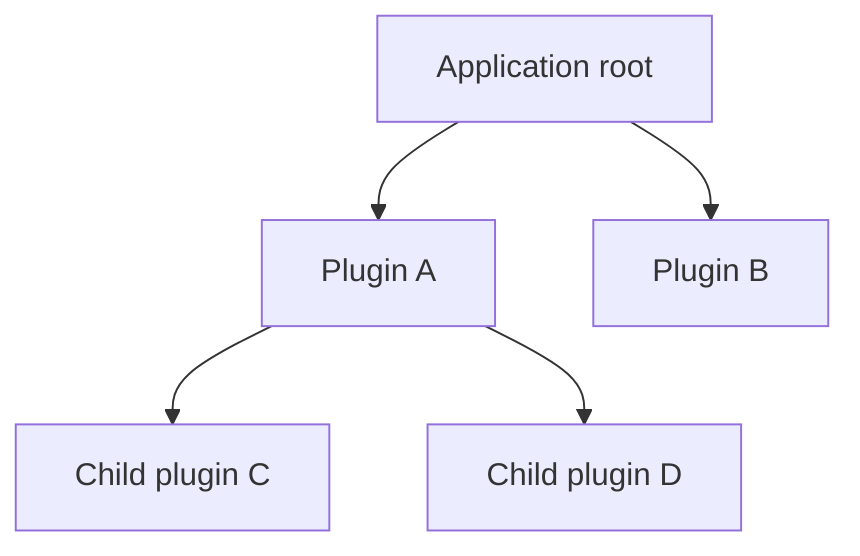

# Rutis Application Development Guide

Rutis is a Rust plugin framework for organizing application features and managing their startup, reload, and shutdown.

With Rutis, you implement features as plugins, share capabilities through services, and distribute data or organize processing through events. The framework orders startup based on declared plugin dependencies, reloads affected plugins when dependencies change, and cleans up resources when plugins exit.

This guide explains how to design applications with these capabilities. For concrete code and API usage, see the [Developer Handbook](development-handbook.en.md). Readers should have a basic understanding of Rust and asynchronous programming.

## Core concepts

### Plugins

A plugin is a feature module that can be loaded and unloaded independently. It groups the initialization, use, and release of a set of resources.

Each plugin implements the `Plugin` interface and initializes itself in `apply`: it reads dependencies, creates services, registers event listeners, and arranges resource cleanup. Once initialization finishes, the plugin enters the `Active` state and begins providing services.

### Services

A service is an object provided by a plugin for use by other components. It may contain shared state or expose callable interfaces.

Services are registered and looked up by type key. A plugin calls `ctx.provide(service)` to register a service, and a consumer calls `ctx.get::<Service>()` to obtain an `Arc<Service>`. When multiple implementations are needed, define a shared interface with a trait.

### Context

`Ctx` is the entry point to framework capabilities for a plugin. It determines where services are looked up and which plugin owns newly created resources.

Services, listeners, cleanup functions, and child plugins registered through a plugin's Ctx are unloaded with that plugin. The root context created at the application entry point manages the whole application.

### Lifecycle

Whenever a plugin is registered, Rutis creates a fiber to manage its runtime state. The returned `FiberView` lets callers observe state, update configuration, restart, or shut down the plugin.

A plugin may run `apply` multiple times. Each load creates a new generation: it creates that generation's resources, runs, and then cleans them up. Dependency recovery, explicit restart, and configuration updates can each start a new generation.

## Division of responsibility

**Plugin authors own the complete lifecycle of business logic and business resources; Rutis provides lifecycle architecture and general-purpose mechanisms.**

Plugin authors create, use, close, and restore resources, registering the relevant logic through framework APIs. Rutis handles dependency management, plugin load/unload, invoking and awaiting cleanup, and general work such as event dispatch.

## Organizing plugins

### Splitting plugins

Plugin boundaries should account for two things: what responsibilities a feature group has, and under what conditions it should start, reload, and stop.

Resources created and released together usually belong in one plugin. Features that need independent configuration, implementation replacement, or start/stop control can be separate plugins. Within a plugin, organize algorithms, data structures, and helper functions with ordinary Rust modules.

When designing a plugin, identify the services it provides, the dependencies it requires, and the resources it releases. Together, these define the plugin boundary.

### Structuring parent and child plugins

Parent-child relationships express resource ownership. Calling `ctx.plugin(child)` from a plugin's `apply` creates a child plugin owned by it. Rutis cleans up those children when the parent unloads.



In this structure, A manages the lifecycles of C and D. B is managed by root and can be started or stopped independently of A.

Parent-child structure is useful for grouping resources that must be released together, and can also represent sessions, connections, or other runtime instances. Choose the hierarchy according to the lifecycles the application needs to manage.

The application entry point creates root, selects plugin implementations, passes configuration, and retains any `FiberView` handles it needs to manage. This entry point is also called the composition root.

### Declaring service dependencies

A service dependency describes a condition required for a plugin to run. A plugin declares service keys through `injects()`. Rutis runs `apply` once those services are ready.

When a provider unloads, its consumers clean up their current resources. Once the service becomes available again, consumers load automatically and obtain the new service object. Put all services required for operation in `injects()` and look them up again in every `apply` to establish this automatic-reload relationship.

Parent-child relationships define the scope of resource release; service dependencies define the scope through which changes propagate. For example, A may create C while C uses a service provided by B: A is responsible for shutting down C, while changes to B's service trigger C to reload.

Initialization dependencies should be one-way. Capabilities needed by multiple plugins can be extracted into a standalone service. A feature that depends on an optional capability can also be isolated in its own plugin and loaded when that capability becomes ready.

### Choosing how long state lives

Choose storage based on how long the state must survive:

| Retention period | Where to store it | Lifecycle |
|---|---|---|
| One load | Create it in `apply` | Released when the current generation unloads |
| Across multiple loads | Longer-lived parent plugin or standalone service | Released with its owner |
| Across process runs | Persistent storage such as files or a database | Managed by the application's save/restore flow |

Separating rebuildable runtime resources from state that must be retained helps control reload impact. For example, when a service dependency changes, a plugin can rebuild connections and tasks while continuing to use state held by its parent.

## Connecting features

### Calling services

A service exposes an object or interface that other components can use directly. After obtaining it, callers interact through its methods, fields, or handles; the service type defines the available capabilities.

Services suit explicit call relationships and shared-resource access. Document inputs, return values, errors, concurrency, and cancellation behavior. If a service can reload, also define how calls on the old object behave after it stops, so consumers can handle state changes.

### Dispatching and handling events

The event bus dispatches events to registered handlers and organizes how those handlers execute. A sender submits an event, handlers register listeners, and the bus finds matching listeners by event type and channel, then invokes them using the selected mode.

When an event has multiple listeners, define execution order, whether dispatch waits for completion, and how results are returned. Rutis provides four dispatch modes:

| API | Execution | Result handling |
|---|---|---|
| `emit` | Returns immediately after submission; invokes listeners sequentially in the background; same-key events are dispatched in order | Listener errors go to ErrorSink |
| `parallel` | Invokes listeners concurrently and waits for all to finish | Returns `()` on success; aggregates errors on failure |
| `serial` | Calls listeners in registration order; stops at the first `Some(value)` or error | Returns the first value; returns `None` if all return `None` |
| `waterfall` | Listeners call later stages through `next` and can process the returned result | Returns the result of the whole call chain |

These mechanisms can support state notifications, request dispatch, plugin collaboration, and middleware processing. For example, multiple listeners can handle one state change independently, or a request can pass through handlers until one returns a result. The event and handler together define the specific use.

When designing an event interface, first define its data and expected result, then choose a dispatch mode. If multiple listeners participate, also define order, error handling, and behavior when no listener exists. Register ordinary listeners with `on`; register waterfalls with `on_waterfall`, and provide the terminal handler at the end of the chain from the caller.

## Organizing multiple instances

### Distinguishing services

Ordinary type keys identify shared services within one root. To provide multiple services of the same type, distinguish them with qualified names. Registration, dependency declarations, and reads must use the same key.

To give a plugin and its children an independent set of services, use instance keys:

```rust,ignore
let instance = ctx.instance();
let state_key = TypeKey::instance::<State>(instance);
```

Here `ctx` belongs to the parent plugin that owns the state. The instance key lets that plugin and its descendants access the service. Pass the key to child plugins for their dependency declarations and reads.

`InstanceId` identifies a plugin instance in the current process. Define separate application-level identifiers for business IDs that must persist across processes.

### Distinguishing event channels

Ordinary events are dispatched on the bus within one root. Named channels distinguish events of the same type by name; instance channels limit registration and sending to the corresponding instance subtree.

For instance events, the parent passes its instance ID to the relevant children. Children use their own context and the same parent instance ID to register and send with `on_instance` and `emit_instance`.

### Choosing service scope

`ctx.isolate(key, label)` selects a lookup scope for a service key. It is useful for reusing one plugin with different service environments.

Within one root, the same key and label identify the same scope; the parent plugin still manages the independent lifecycle. See [service keys and scopes in the Developer Handbook](development-handbook.en.md#service-keys-and-scopes) for details.

## Managing runtime operation

### Startup

After the host registers a plugin, it can check whether required plugins have reached `Active` to determine readiness. A plugin whose dependencies are not yet satisfied remains `Pending` and continues loading when they become available.

The parent plugin finishes its own initialization and returns; the host then gathers child readiness. This order is suitable when children depend on services from the parent: the parent becomes an available provider first, then children start.

### Updates

Create plugins that need configurable updates through `PluginFactory`. After the host calls `view.update(config)`, Rutis validates the new configuration, cleans up the old instance, and loads the new one; consumers of the plugin reload as well.

During an update, the host can observe plugin state and record the result. If the new instance fails to load, the host chooses whether to retry, restore the previous configuration, or leave the plugin failed. Decide in advance how to handle state that must be retained and operations that are still running.

### Shutdown

When a plugin exits, finish its current work according to the contract, then release its resources. After receiving a cancellation signal, a background task may cancel its current operation or finish the permitted amount of work before exiting. Cleanup waits for the task to actually stop before releasing resources it uses.

Use `FiberView::shutdown()` to shut down a plugin and its subtree; use `root.shutdown()` to exit the whole application. With a wait timeout, the host can report shutdown progress promptly and retain the handle to keep waiting for the result.

## Development conventions

Before implementation, capture these conventions in the design:

1. **Split plugins by lifecycle.** Put resources created and released together in one plugin; use child plugins for independently controlled features.
2. **Declare every required dependency.** Define service keys consistently, declare dependencies in `injects()`, and look them up again on each load.
3. **Finish initialization promptly.** `apply` creates resources and registers cleanup; continuous work runs in managed background tasks.
4. **Define resource release.** Register cleanup soon after acquiring a resource; retain both the cancellation signal and task handle for background tasks.
5. **Place state according to retention period.** Keep temporary state in the current load; let a parent or persistent storage retain long-lived state.
6. **Define readiness conditions.** After startup, reload, and config updates, use required plugin states to determine when dependent work can proceed.
7. **Implement the full resource lifecycle.** Plugin authors own initialization, operation, shutdown, and state recovery when needed.

Design documents can focus on four topics: plugin responsibilities, parent-child structure and service dependencies, state retention, and update/shutdown behavior. Once those are clear, use the [Developer Handbook](development-handbook.en.md) to implement them.

---

Applies to Rutis 0.3.0. Behavior is based on repository commit `015d48c`.
